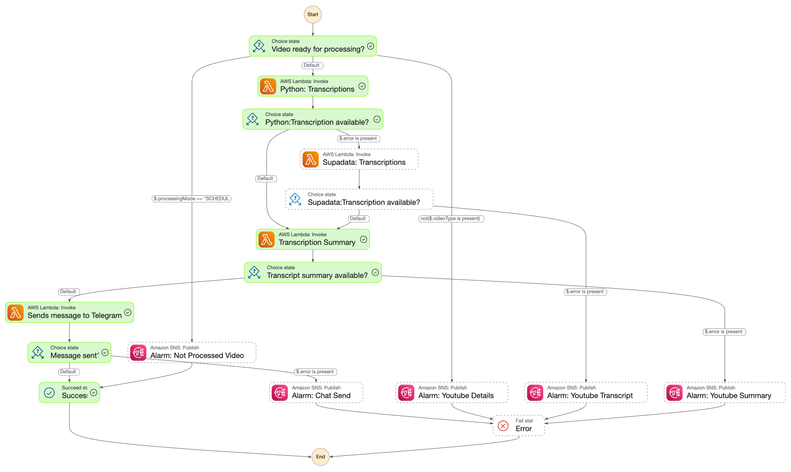

# Youtube News

Youtube News ingests YouTube WebSub notifications, enriches them with video metadata, and publishes summarised updates
to Telegram. The project is defined with AWS CDK in TypeScript and runs entirely on serverless services.

## What It Does

- Receives YouTube notifications through API Gateway and validates WebSub signatures.
- Stores notifications, videos, transcripts, summaries, and subscriptions in a single DynamoDB table.
- Pulls video details, transcribes content, generates AI summaries, and posts formatted messages to Telegram.
- Renew subscriptions automatically and handles live or upcoming videos with a scheduled poller.

## Architecture

High-level data flow:

1. **YouTube WebSub** pushes to API Gateway. Two Lambdas sit behind the `/ytpubsub` resource: a lightweight receiver
   that
   validates the HMAC and forwards the raw payload to SQS, and a challenge handler for subscription verification.
2. **Notification queue** (SQS) buffers events and feeds a dedicated processor Lambda. The processor enriches the
   payload
   with channel metadata, applies dedupe/TTL rules, persists it to DynamoDB, and decides whether the video is ready for
   immediate processing or should stay scheduled.
3. **Step Functions pipeline** is kicked off only for videos that are ready now. The state machine begins with the
   Python
   transcription Lambda, automatically falls back to the Supadata provider, runs summary generation (Gemini or Bedrock),
   and finally dispatches the formatted update to Telegram.
4. **Scheduled poller** promotes deferred (LIVE/UPCOMING) items once YouTube reports they are complete. Subscription
   renewals are dispatched through EventBridge + SQS, with DLQs wired to an alarm-processing Lambda.

Core shared services: a single DynamoDB table with LSI/GSI for notification scheduling, Secrets Manager for API keys,
SNS for alarms, and reusable Lambda layers for Axios/Gemini clients.

## Orchestration Overview

